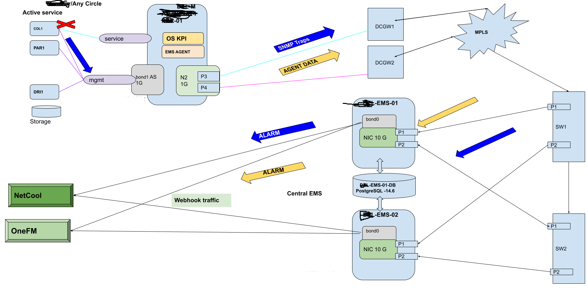

## EMS Monitoring Architecture (Zabbix-Based)

This section describes the EMS01/EMS02 event management architecture, used for centralized 
monitoring of application nodes such as Collector (COL1), Parser (PAR1), and Distributor (DRI1) along with the hardware monitoring.

###  Overview
The architecture provides complete visibility into CDR/application processing, enabling 
proactive monitoring through Zabbix. It integrates OS-level KPIs, service health checks, 
SNMP traps for app and hardware, and alarm forwarding to external NMS systems.

###  Key Components

#### **Application Nodes**
- **COL1** – Collection 
- **PAR1** – Parser  
- **DRI1** – Distributor  
Each node runs an EMS Agent responsible for:
- OS KPIs  
- Application service health monitoring  
- Generating SNMP traps for critical issues  
- Sending metrics to EMS servers  

#### **EMS01 & EMS02 – Event Management Systems (Zabbix Servers)**
These redundant nodes:
- Receive SNMP traps & KPI telemetry  
- Process and store events  
- Maintain PostgreSQL back-end databases  
- Forward alarms to external NMS systems  
- Ensure high availability for monitoring  

#### **Network Layer**
- **DCGW1 / DCGW2** – Datacenter gateways for routing EMS traffic  
- **MPLS cloud** – Provides WAN connectivity between application nodes and EMS servers  
- **SW1 / SW2** – Redundant switches connecting EMS01 and EMS02  

#### **Integration with other Systems**
- **Netcool**  
- **OneFM**  
Alarms are sent via **webhooks**, enabling enterprise-level event correlation.

---

###  Alarm Processing Flow
1. EMS Agent detects fault on COL1/PAR1/DRI1  
2. SNMP Trap or KPI event is sent to EMS01/EMS02  
3. EMS processes the event and generates an alarm  
4. Alarm forwarded to Netcool & OneFM  
5. Operator takes corrective action  

---

###  Purpose of This Diagram
This architecture demonstrates:
- Multi-node application monitoring  
- Redundant EMS/Zabbix server design  
- SNMP + KPI-based observability  
- Alarm forwarding via webhook  
- High availability monitoring topology

